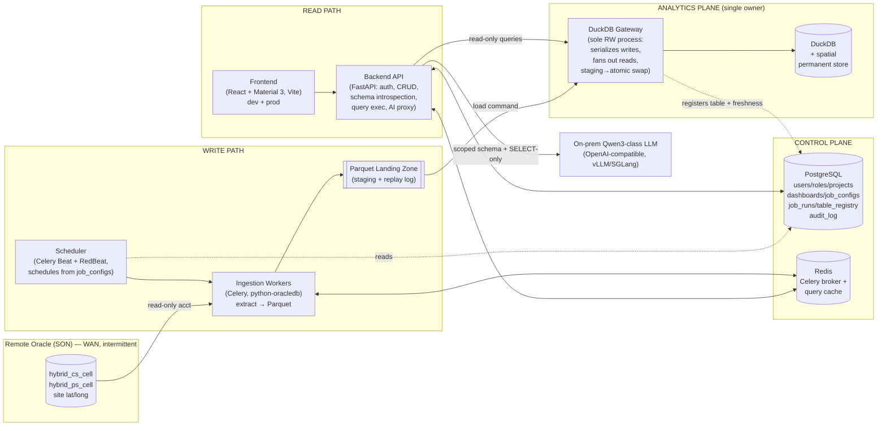

# UPM Platform — Architecture & Delivery Plan (v3)

**Telecom IT‑OSS Unified Performance Management** · greenfield monorepo · on‑prem only
Status: planning. No application code yet. This document is the decision record the build follows.

---

## 0. What changed from the v2 brief (my modifications)

This plan keeps the v2 architecture — it was sound — and resolves the four things most likely to bite, plus a few smaller ones. If you only read one section, read this and §9.

| # | Issue in v2 | Resolution in this plan |
|---|-------------|-------------------------|
| 1 | **DuckDB multi‑process write conflict.** v2 says "backend is sole writer" *and* "scheduler enqueues to a single ingestion worker." A DuckDB file allows only **one** read‑write process. Separate Celery worker + backend both touching the file is illegal. | A single **DuckDB Gateway** is the only thing that opens the file read‑write. Celery never writes DuckDB — it extracts from Oracle to a **Parquet landing zone**, then hands a load command to the Gateway. See §9. |
| 2 | **No durability/backup story** for a permanent store that is the system of record. | The Parquet landing zone doubles as a **replay log**: DuckDB can be rebuilt from Parquet without touching Oracle — exactly the recovery you need during a WAN outage. Plus scheduled `EXPORT DATABASE`. See §9.4. |
| 3 | **Builder‑authored Oracle SQL** is the most dangerous surface and had the least guardrail. | Builders compose **structured queries** (table → columns → typed predicates), not raw strings. Raw SQL is an opt‑in power path behind sqlglot validation + read‑only Oracle account + resource caps. See §11.2. |
| 4 | **Freshness invisible to viewers.** They'd make telecom decisions on silently‑stale data. | Freshness is a **first‑class field** in the table registry and every query response; UI shows "data as of …" and a stale badge. Cache invalidation is tied to it. See §10. |
| 5 | AI: "inject the whole catalog at 262K." | **Scoped** schema injection (only the user's accessible tables) + on‑demand `describe_table`. See §13 Phase 5. |
| 6 | "Material 3 library" unspecified; "Qwen 3.6" not a known release. | Pin MUI v6+ (M3 theming) with `@material/web` noted as the strict‑fidelity fallback. Treat the LLM as a confirmed‑later, OpenAI‑compatible, Qwen3‑class endpoint behind a provider‑agnostic client. See §3 ADR‑009 and §16. |
| 7 | 3 hardcoded roles. | Roles are **capability sets** so splitting "Job Author" from "Dashboard Author" later is config, not a refactor. See §11.1. |

---

## 1. Mission & principles

A centralized, self‑service platform where **Builders** define how telecom KPI data gets in (Extraction Job Builder) and how it's shown (Dashboard Builder), and **Viewers** consume only the dashboards they're granted. Data is **materialized permanently in DuckDB**; dashboards query DuckDB only and never touch Oracle.

**Inviolable principles**

1. **Oracle is touched in exactly one place** — the extraction step. Nothing on the read path can reach Oracle.
2. **Write path and read path meet only at DuckDB.** Write: Oracle → extract → Parquet → Gateway → DuckDB. Read: viewer → backend → Gateway → DuckDB (read‑only).
3. **One process owns the DuckDB file.** Everyone else is a client of the Gateway.
4. **Config is data.** Jobs, dashboards, users, roles live as rows in the Postgres control plane. Adding a feed or a chart never touches code.
5. **Dashboards survive Oracle/WAN outages.** The data is local; staleness is shown, not hidden.

---

## 2. Architecture overview



**Why the Gateway is its own box.** It is the single legal owner of the DuckDB file. In the MVP it's an in‑process module inside the backend; when read concurrency or ingestion volume forces it, the *same interface* is lifted into a standalone single‑instance service and the multi‑worker backend becomes a client. Nothing else in the system has to change — and it's the natural seam to swap DuckDB for ClickHouse later.

---

## 3. Architecture Decision Records (resolved)

Each ADR: decision · why · trade‑off / trigger to revisit.

- **ADR‑001 — Columnar store: DuckDB (permanent, materialized).** Read‑heavy KPI aggregations over append‑mostly data; embedded, zero‑ops, `spatial` for lat/long. *Trade‑off:* single RW process (mitigated by Gateway, §9). *Trigger to ClickHouse:* sustained >2B rows/table, >~50 concurrent heavy viewers, or write throughput exceeding a single serialized writer.
- **ADR‑002 — Single‑writer via DuckDB Gateway.** One process opens the file RW; ingestion routes writes through it; reads fan out as read‑only cursors. *Trade‑off:* the Gateway is a single instance (a scaling ceiling, not a SPOF for reads if you keep a read replica file). Accepted for MVP.
- **ADR‑003 — Two stores.** PostgreSQL control plane (transactional metadata) strictly separate from DuckDB analytics plane (columnar data). Never co‑mingle. *Trade‑off:* two engines to operate — worth it.
- **ADR‑004 — Scheduler: Celery + Redis, schedules in the DB via RedBeat.** Reuses your production experience; **no DAG files** (config is data); gives retries/backoff/DLQ and a worker pool for free. *Rejected:* Airflow (heavy, DAG‑file model contradicts config‑as‑data); APScheduler (single‑process, weak distributed retry/DLQ). *Trade‑off:* you operate a beat + worker; acceptable.
- **ADR‑005 — Ingestion via Parquet landing + atomic swap.** Workers extract Oracle → Parquet; Gateway loads Parquet → staging table → transactional swap. *Benefit:* decouples "talk to Oracle" (parallel) from "write DuckDB" (serialized); the Parquet files are also the backup/replay log (ADR‑006).
- **ADR‑006 — Durability: Parquet replay + scheduled EXPORT.** Rebuild DuckDB from retained Parquet without Oracle; periodic `EXPORT DATABASE` snapshot. Directly answers "Oracle unreachable during recovery."
- **ADR‑007 — Load modes + retention per job.** full‑refresh · append · upsert‑by‑key; retention = `keep_forever` or `rolling_window(N)` with scheduled compaction. Default proposal: rolling 13 months + monthly compaction, Parquet replay kept 30 days (confirm in §16).
- **ADR‑008 — RBAC as capabilities, project‑scoped.** Roles map to capability sets; access scoped per project. Three roles ship (Admin / Builder / Viewer) but the model supports splitting later without a rewrite.
- **ADR‑009 — Frontend: React + Vite + MUI v6+ (Material‑3 theming).** Pragmatic, mature React path. `@material/web` (official M3 web components) noted as the strict‑fidelity fallback if pixel‑exact M3 is mandated. *Decision now to avoid churn later.*
- **ADR‑010 — Maps: MapLibre GL (production) + Kepler.gl (exploration), DuckDB `spatial` backend.** As in v2; confirmed.
- **ADR‑011 — AI: provider‑agnostic OpenAI‑compatible client, SELECT‑only over DuckDB.** Model identity ("Qwen 3.6") confirmed later; the abstraction means the exact build/endpoint is swappable. Guardrails in §13 Phase 5.

---

## 4. Monorepo structure

```
upm-portal/
  apps/
    frontend/            # React + Vite + MUI(M3); builds twice (dev/prod). Builder + Viewer surfaces.
    backend/             # FastAPI: auth, RBAC, CRUD, schema introspection, query exec, AI proxy.
    ingestion/           # Celery workers: Oracle → Parquet landing (python-oracledb).
    scheduler/           # Celery Beat + RedBeat: schedules derived from job_configs rows.
    dataplane-service/   # (Phase 4+) optional standalone DuckDB Gateway host. MVP: gateway runs in backend.
  packages/
    dataplane/           # DuckDB Gateway: single-writer, staging→swap, read fan-out, registry writes.
    shared-schemas/      # Pydantic + generated TS types: API contracts, dashboard def, job def (one source of truth).
    sql-tools/           # sqlglot validators + safe structured query builders (Oracle dialect + DuckDB dialect).
  control-plane/
    migrations/          # Alembic migrations for the Postgres control plane.
  infra/
    compose/             # docker-compose.dev.yml, docker-compose.prod.yml, .env templates.
    proxy/               # Traefik (or Nginx) routing config.
    observability/       # Prometheus, Grafana dashboards, alert rules.
  data/                  # (volumes, gitignored) duckdb/ , landing/ , exports/ , postgres/
  docs/
    architecture-plan.md # this file
    adr/                 # ADRs split out per record as they stabilize
```

---

## 5. Control‑plane data model (PostgreSQL)

Signature‑level; PK/FK/timestamps implied.

- **users**(id, email ᵁ, hashed_password, full_name, is_active, created_at)
- **roles**(id, name) · **capabilities**(id, key) · **role_capabilities**(role_id, capability_id)
- **user_project_roles**(user_id, project_id, role_id) — project‑scoped RBAC; Admin role is global.
- **projects**(id, name, description, created_by, created_at)
- **dashboards**(id, project_id, name, definition `JSONB`, version, created_by, updated_at) — see §7.
- **job_configs**(id, name, source_schema, source_table, query_definition `JSONB`, target_table ᵁ, schedule `JSONB`, load_mode, watermark_column, key_columns `text[]`, retention `JSONB`, guards `JSONB`, is_enabled, created_by) — see §8.
- **job_runs**(id, job_config_id, attempt, status, started_at, finished_at, rows_read, rows_written, watermark_before, watermark_after, landing_path, error) — run history / observability.
- **table_registry**(table_name PK, source_job_id, schema_json `JSONB`, row_count, table_version, last_load_started_at, last_load_succeeded_at, last_load_status, last_watermark_value, is_visible) — drives Dashboard Builder **and** freshness (§10).
- **audit_log**(id, actor_id, action, entity_type, entity_id, before `JSONB`, after `JSONB`, ts) — every change + every job run.

---

## 6. API contracts (signature level)

`Authorization: Bearer <JWT>` on all but `/auth/login`. All write endpoints append to `audit_log`. All SQL is parameterized and SELECT‑validated.

**Auth & users**
- `POST /auth/login` → `{access_token, refresh_token, user}`
- `POST /auth/refresh` → `{access_token}`
- `GET  /me` → `{user, capabilities, projects}`
- `POST /admin/users` · `PATCH /admin/users/{id}` · `POST /admin/users/{id}/project-roles` *(cap: user:manage)*

**Schema introspection (registry‑backed; never hits Oracle)**
- `GET /catalog/tables` → `[{table_name, row_count, last_load_succeeded_at, last_load_status, is_visible}]`
- `GET /catalog/tables/{name}` → `{columns:[{name,type,comment}], freshness, sample_rows?}`

**Dashboards & query**
- `GET/POST /projects/{pid}/dashboards` · `GET/PUT/DELETE /dashboards/{id}` *(read: project:view; write: dashboard:author)*
- `POST /query` → body `{table, columns, aggregations, filters, sort, limit, page}` → `{rows, page, total, table_version, data_as_of}` *(read‑only Gateway; cached, §10)*

**Jobs (Builder)**
- `GET/POST /jobs` · `GET/PUT/DELETE /jobs/{id}` *(cap: job:author)*
- `POST /jobs/validate` → dry‑run: sqlglot parse + Oracle `EXPLAIN PLAN` with row cap → `{ok, estimated_cost, columns, warnings}`
- `POST /jobs/{id}/preview` → bounded `FETCH FIRST n ROWS` sample *(uses read‑only Oracle acct + call_timeout)*
- `POST /jobs/{id}/run` → enqueue ad‑hoc run · `GET /jobs/{id}/runs` → run history

**AI proxy (Phase 5)**
- `POST /ai/chat` (SSE) → tool‑calling loop over `list_tables`/`describe_table`/`run_readonly_sql`/`propose_chart`; scoped schema; returns assistant turns + optional chart spec JSON.

---

## 7. Dashboard definition schema (JSONB)

```jsonc
{
  "version": 1,
  "layout": { "cols": 12, "rowHeight": 40 },
  "widgets": [
    {
      "id": "w1",
      "type": "line",                       // line|bar|area|pie|scatter|kpi|table|map
      "title": "CS traffic by cell",
      "source": { "table": "hybrid_cs_cell", "table_version_pin": null },
      "query": {
        "columns": ["timestamp", "cell_id"],
        "aggregations": [{ "fn": "avg", "col": "traffic_erl", "as": "traffic" }],
        "groupBy": ["timestamp", "cell_id"],
        "filters": [{ "col": "region", "op": "in", "value": ["North"] }],
        "sort": [{ "col": "timestamp", "dir": "asc" }],
        "limit": 5000
      },
      "viz": { "x": "timestamp", "series": "cell_id", "y": "traffic" },
      "grid": { "x": 0, "y": 0, "w": 6, "h": 6 }
    }
  ]
}
```

Map widgets add `viz: { lat, lon, weight, tooltip[] }` and use the DuckDB `spatial` backend.

---

## 8. Job definition schema (JSONB)

```jsonc
{
  "name": "load_hybrid_cs_cell",
  "source": {
    "schema": "SON",
    "table": "hybrid_cs_cell",
    "mode": "structured",                   // structured (safe) | raw (power user, validated)
    "columns": ["timestamp", "cell_id", "traffic_erl", "drop_rate"],
    "filters": [{ "col": "timestamp", "op": ">", "param": "watermark" }],
    "raw_sql": null
  },
  "target_table": "hybrid_cs_cell",
  "schedule": { "every": "1h" },
  "load_mode": "upsert",                     // full | append | upsert
  "watermark": { "column": "timestamp", "type": "timestamp" },
  "key_columns": ["cell_id", "timestamp"],   // for upsert + idempotent dedup
  "retention": { "strategy": "rolling_window", "window_days": 395 },
  "guards": { "row_cap": 5000000, "timeout_s": 300 }
}
```

---

## 9. The write path in detail (the centerpiece fix)

### 9.1 Roles
- **Celery worker** — talks to Oracle (read‑only account), extracts the watermarked delta, writes a Parquet file to the landing zone. May run with concurrency > 1 (Oracle I/O is parallel‑safe). **Never opens DuckDB.**
- **DuckDB Gateway** — the *only* process that opens the file RW. Consumes one load command at a time (Redis single‑consumer queue / concurrency=1), performs staging → atomic swap, updates `table_registry`. Fans out read‑only cursors for the read path.

### 9.2 Per‑run sequence (incremental, idempotent)
1. Worker reads `last_watermark_value` from `table_registry`.
2. Extract from Oracle `WHERE watermark > :last` (bounded by `guards`), stream to `landing/{table}/{run_id}.parquet`.
3. Enqueue load command `{table, landing_path, load_mode, key_columns, watermark}`.
4. Gateway loads Parquet into `{table}__staging`:
   - **full** → `CREATE OR REPLACE TABLE {table} AS SELECT * FROM '{parquet}'`
   - **append** → insert into staging, then transactional swap
   - **upsert** → `DELETE` matching `key_columns` then insert, inside one transaction (idempotent on replay)
5. Transactional swap; update `table_registry` (row_count, watermark, `last_load_succeeded_at`, `table_version++`).
6. Invalidate read cache for that table (§10).

Idempotent because the watermark advances only on commit and upsert keys dedupe a replayed Parquet file.

### 9.3 Fault tolerance
Celery retries with exponential backoff; exhausted retries → dead‑letter queue + `job_runs.status=failed` + alert. A crash between extract and load just leaves an unconsumed Parquet file → re‑load is safe. Oracle/WAN unreachable → the run fails, **the read path keeps serving local data**, and the table is flagged stale (§10).

### 9.4 Durability & backup
- **Replay log:** retain landing Parquet for N days (default 30). Rebuild any table — or the whole store — from Parquet **without Oracle**.
- **Snapshot:** scheduled `EXPORT DATABASE 'data/exports/{date}'` (Parquet + schema) during a brief Gateway‑held quiesce/checkpoint.
- **Recovery runbook** documented in `docs/`: restore from latest export, replay Parquet since, resume schedule.

---

## 10. Freshness & caching (trust model)

- Every `table_registry` row carries load status + `last_load_succeeded_at` + `last_watermark_value` + `table_version`.
- `POST /query` returns `data_as_of` and `table_version`; the UI renders **"Data as of <ts>"** on every widget and an **amber stale badge** when `now − last_success > schedule.interval × k` (default k=2), or a red banner when the latest run failed.
- **Cache:** Redis keys are `query:{table_version}:{hash(query+params)}`. A swap bumps `table_version`, which atomically invalidates that table's cache — caching and freshness use the same lever, so cache can never serve data older than the registry claims.

---

## 11. Security & RBAC

### 11.1 Roles as capabilities
| Capability | Admin | Builder | Viewer |
|---|:--:|:--:|:--:|
| user:manage | ✓ | | |
| job:author | ✓ | ✓ | |
| dashboard:author | ✓ | ✓ | |
| project:view (scoped) | ✓ | ✓ | ✓ |

Splitting `job:author` from `dashboard:author` later = add a role row; no code change.

### 11.2 Oracle SQL governance (the dangerous surface)
- **Default = structured builder:** UI picks table/columns/typed predicates; the server renders SELECT via `sql-tools` (sqlglot AST) — no user string is ever executed.
- **Raw mode (opt‑in, audited):** sqlglot must parse it as **single‑statement SELECT only**, against the **allow‑listed `SON` schema**, with a mandatory bounded predicate; rejected otherwise.
- **Execution safety:** dedicated **read‑only Oracle service account** with an Oracle resource profile (caps on logical reads / CPU per call) + python‑oracledb `call_timeout` + `FETCH FIRST n` on preview. Validate on save via `EXPLAIN PLAN`.
- **Read path:** the Gateway exposes only a read‑only connection; the AI path additionally re‑validates SELECT‑only with a schema allow‑list and row/time limits. Oracle credentials and the write path are **never** reachable from chat.

### 11.3 Platform security
JWT (access+refresh), bcrypt/argon2 passwords, project‑scoped authorization checks server‑side on every request, secrets via Docker secrets / env files (never in config rows), full audit trail.

---

## 12. Observability
- Structured JSON logs (structlog) with request/run correlation IDs.
- **Prometheus + Grafana** (on‑prem, no cloud): per‑job duration/rows, success/fail counters, queue depth, query latency, cache hit rate, **stale‑table gauge**.
- **Alerting** on: missed/over‑due loads, watermark not advancing, DLQ growth, Oracle/LLM health‑check failures.
- `job_runs` is the user‑facing run history; `/health` per service for the proxy.

---

## 13. Phased roadmap (MVP first)

**Phase 0 — Skeleton.** Monorepo, Docker Compose (dev), Postgres + Alembic, Redis, `shared-schemas`, auth scaffold, CI, the **Gateway interface** + Parquet landing pattern (even if trivial). *Exit:* services boot and talk.

**Phase 1 — MVP (demo‑able).** One structured job loads `hybrid_cs_cell` (full refresh) → Parquet → Gateway swap → `table_registry` with freshness; `/catalog/*` introspection; one dashboard rendered from a definition; **Viewer role** + project scoping; "data as of" badge; basic query cache. *Exit:* a Viewer logs in and reads a live KPI dashboard sourced end‑to‑end.

**Phase 2 — Extraction Job Builder.** Load modes (append/upsert), watermarks, idempotency, retries/backoff/**DLQ**, run‑history UI, **Builder role**, **Oracle SQL governance** (structured builder + sqlglot + read‑only acct + guards), validate/preview. *Exit:* a Builder creates a new feed from the UI with zero deploys.

**Phase 3 — Dashboard Builder.** Full chart palette (line/bar/area/pie/scatter/KPI/table), structured filters, grid layout, projects grouping, `hybrid_ps_cell` use‑cases, cache invalidation on load. *Exit:* a Builder composes and shares a multi‑widget dashboard.

**Phase 4 — Maps, retention, depth.** MapLibre (prod) + Kepler (explore) on `spatial`; retention/compaction jobs; RBAC depth + project‑scope polish; **observability** (Prometheus/Grafana + alerts); backup/replay tooling; promote Gateway to standalone service **if** triggers in ADR‑002 are hit. *Exit:* production‑grade ops.

**Phase 5 — AI chat (Qwen, last/optional).** Text‑to‑SQL over DuckDB; **scoped** schema injection + `describe_table` on demand (not whole‑catalog dump); native tool calling (`list_tables`, `describe_table`, `run_readonly_sql`, `propose_chart`); structured chart JSON; thinking‑mode toggle; **guardrails** (dedicated read‑only conn, sqlglot SELECT‑only + allow‑list + row/time caps). *Optional earlier bonus behind a flag:* Qwen assists Builders (draft extraction SQL / suggest charts).

---

## 14. Deployment

**Compose services:** `frontend-dev`, `frontend-prod`, `backend` (hosts the Gateway in MVP — **single instance** while it owns the file), `scheduler` (beat), `worker` (ingestion, scalable), `postgres`, `redis`, `traefik`, `prometheus`, `grafana`. Phase 4 may split out `dataplane-service`.

**Volumes:** `data/duckdb` (analytics plane), `data/landing` (Parquet staging + replay), `data/exports` (snapshots), `data/postgres`.

**Proxy routing (Traefik):** `/` → frontend‑prod, `/dev` → frontend‑dev, `/api` → backend, `/grafana` → grafana. TLS terminates here.

**Topology:** single VM for dev + MVP/early‑prod. The DuckDB owner is a single instance by design — document this as a deployment constraint. Multi‑host only after promoting the Gateway to its own service (ADR‑002 trigger).

**Secrets:** Docker secrets / `.env` (gitignored); Oracle read‑only creds and JWT keys never in config rows or the repo.

---

## 15. Testing strategy

- **Unit:** `sql-tools` validators + structured builders, schema parsers, load‑mode logic (pure functions).
- **Oracle without the live warehouse:** **Oracle XE 21c container** seeded with fixture `SON.hybrid_cs_cell`/`hybrid_ps_cell` (DDL + sample rows) via python‑oracledb thin mode; plus recorded **Parquet fixtures** to test the load path with no Oracle at all.
- **Integration (testcontainers):** Oracle XE → ingestion → Parquet → Gateway → DuckDB → `/query`. Postgres + Redis containers for the control plane.
- **Contract:** `shared-schemas` validated on both Python and TS sides.
- **E2E:** Playwright against dev + prod frontends (Builder creates job → dashboard; Viewer reads).
- **Fault/chaos:** Oracle unreachable (dashboards still serve + stale badge), worker crash mid‑load (idempotent replay), corrupt‑swap recovery from Parquet, watermark‑stall alert fires.
- **AI:** golden‑set text‑to‑SQL eval + guard tests (reject non‑SELECT, cross‑schema, unbounded).

---

## 16. Risk register & open questions (with my recommended defaults)

| Risk / question | Default I'd proceed with | Need from you |
|---|---|---|
| **DuckDB concurrency ceiling** | Gateway single‑writer now; promote to standalone service at ADR‑002 triggers | Confirm acceptable for v1 |
| **Durability** | Parquet replay (30d) + scheduled EXPORT | Confirm retention of replay log |
| **Oracle source schema drift** | Detect on extract → quarantine run + alert, don't silently break the table | Confirm desired behavior |
| **Row counts & growth** (`hybrid_cs/ps_cell`) | Assume DuckDB‑comfortable (<~500M rows/table) | **Real numbers, please** |
| **Refresh interval** | Hourly | Confirm minutes/hourly/daily |
| **Retention** | Rolling 13 months + monthly compaction | Confirm vs keep‑forever |
| **Oracle access** | Read‑only service account + resource profile + network path | Provision it |
| **LLM identity** ("Qwen 3.6", 262K, limits) | Provider‑agnostic OpenAI‑compatible client; design to capabilities, confirm later | Endpoint, model id, context, rate limits |
| **Concurrency / hosts** | Single VM MVP; promote Gateway if >~50 concurrent heavy viewers | Peak viewers; single vs multi‑host |
| **Material 3 fidelity** | MUI v6+ M3 theming | Is pixel‑exact M3 required? (then `@material/web`) |

---

*Next:* on your go, I'll split the ADRs into `docs/adr/*.md`, then scaffold Phase 0 (monorepo + Compose + Postgres migrations + the Gateway interface). No app code until you confirm the §16 defaults you care about.*
