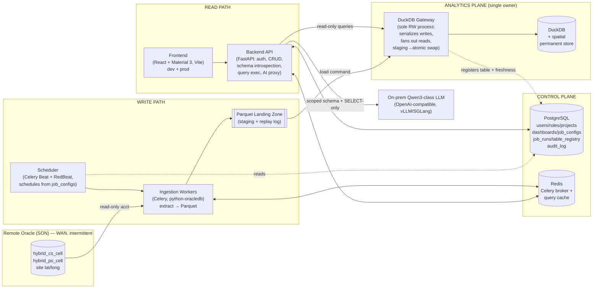

# UPM Platform — The Grand Tour 🎟️
### or: *How a single number escapes a faraway database and grows up to be a chart*

You said "take the risk and kick it off." I did. Now here's the museum tour of what got
built — no jargon left unexplained, every tool introduced like a character with a job, and
hopefully zero yawns. Grab a coffee. ☕

---

## 1. The one-sentence mission (the whole point)

> Telecom engineers have KPI data trapped in a **faraway Oracle database** across a **flaky
> network**. We want them to build dashboards on that data **without** hammering Oracle, and
> keep working **even when Oracle is unreachable.**

Everything below is in service of that sentence. If a design choice doesn't serve it, it got cut.

The trick the whole system is built around:

> **Copy the data once, locally, into a fast store. Then never bother Oracle again on the read side.**

That's it. That's the magic. The rest is plumbing — but it's *good* plumbing, and plumbing is
where projects live or die.

---

## 2. The cast of characters 🎭

Think of the platform as a small town with very specialized residents.

| Resident | Real name | Their job (in human words) |
|---|---|---|
| 🏭 **The faraway warehouse** | Oracle (SON) | Where the raw KPI data actually lives. Across a rickety bridge (the WAN). We visit as rarely as possible. |
| 🚚 **The delivery drivers** | Celery workers (`apps/ingestion`) | Drive to the warehouse, grab a box of fresh data, drop it on the loading dock. They never touch the pantry. |
| 📦 **The loading dock** | Parquet "landing zone" | Where boxes of data sit after delivery. Doubles as a **receipt archive** so we can rebuild everything later. |
| 🧑‍🍳 **The one librarian with the keys** | DuckDB **Gateway** (`packages/dataplane`) | The *only* person allowed to write in the pantry ledger. Takes boxes from the dock, shelves them, updates the catalog. |
| 🥫 **The pantry** | DuckDB | The fast local store dashboards actually read from. Lives next door, not across the bridge. |
| 🗄️ **The filing cabinet** | PostgreSQL "control plane" | Who's who, which jobs exist, which dashboards exist, who's allowed to see what. *Not* the data itself — the paperwork *about* the data. |
| 📮 **The pneumatic tubes** | Redis | Little message capsules whoosh between residents. "Hey, there's a box on the dock!" |
| ⏰ **The alarm clock** | Celery Beat + RedBeat (`apps/scheduler`) | Rings every hour and tells the drivers "time to fetch fresh data." |
| 🛎️ **The front desk** | FastAPI backend (`apps/backend`) | Everyone talks to the front desk. It checks your keycard, fetches what you asked for, and is *also where the librarian works.* |
| 🖥️ **The showroom** | React frontend (`apps/frontend`) | The pretty windows where viewers see charts. Talks only to the front desk. |

The single most important rule of the town, repeated like a mantra:

> 🧑‍🍳 **Exactly one librarian writes to the pantry.** Everyone else hands boxes to the dock and
> asks the librarian nicely.

Why so strict? Because DuckDB (the pantry) is a single file, and a single file can only have
**one writer at a time** without corruption. So instead of *hoping* nobody else writes, we made it
*structurally impossible*: only the Gateway holds the pen. This is the spine of the whole design.

---

## 3. The two great journeys 🗺️

Everything that happens is one of two trips.

### Journey A — "Get the data in" (the Write Path) ✍️

```
⏰ alarm rings  →  🚚 driver visits 🏭 Oracle  →  📦 drops a Parquet box on the dock
              →  📮 "box ready!" capsule to Redis  →  🧑‍🍳 librarian shelves it in 🥫 DuckDB
              →  🗄️ updates the catalog: "table is fresh, version 7, 588 rows"
```

A few clever details that make this robust instead of fragile:

- **Watermarks.** The driver doesn't re-fetch *everything* each hour. It remembers "last time I got
  data up to 3:00 PM" and asks Oracle for "only stuff newer than 3:00 PM." Less network, less load.
- **Idempotency** (fancy word, simple idea). If the same box gets shelved twice (because something
  hiccupped and retried), you don't get double the data. For "upsert" tables we delete-then-insert by
  key, so a replay lands exactly the same. *Doing it twice = doing it once.* Peace of mind.
- **The dock is also a backup.** Those Parquet boxes stick around for 30 days. If the pantry burns
  down (file corrupts), we rebuild it from the boxes — **without ever calling Oracle.** That's the
  "survives a WAN outage" promise, made real.

### Journey B — "Show the data" (the Read Path) 👀

```
🖥️ viewer opens a dashboard  →  🛎️ front desk checks the keycard
   →  asks 🧑‍🍳 librarian (read-only) →  🥫 DuckDB runs a fast query
   →  front desk stamps it "data as of 3:00 PM"  →  📊 chart appears
```

Notice what's **not** in Journey B: **Oracle.** The read path *physically cannot* reach the
warehouse. Even if the bridge is on fire, dashboards keep working off the local pantry — they just
show an honest **amber "stale" badge** so nobody makes a decision on old milk. 🥛

### Journey A now has three on-ramps 🛣️ (Phase 2)

The "get data in" trip used to start only at Oracle. The **Ingest** page now offers three doors,
and all three end at the same loading dock + librarian:

| Door | What you do | What happens underneath |
|---|---|---|
| 📄 **CSV file** | Drag a file in. | DuckDB's sniffer infers the delimiter/header/column types; you review the schema and preview rows; saving creates a normal load job (upload → Parquet → Gateway). |
| 🔌 **From connection** | Pick a saved connection (Oracle/Postgres/MySQL/MSSQL — credentials stored **encrypted**), pick a table. | SQLAlchemy introspects the table's schema, shows a preview, then the worker extracts → Parquet → Gateway, same as always. |
| ⌨️ **DuckDB SQL** | Write a SELECT over tables *already in the pantry*. | The SQL is frisked (single-statement SELECT only), previewed, then saved as a **transform job** — the *librarian themself* runs it (workers never touch DuckDB), materializing the result as a new table. |

Whatever the door, the result is identical: a scheduled **job** row in the filing cabinet, a
**table** in the pantry, a **freshness** entry in the catalog — and the table is immediately
usable in the Dashboard Builder.

---

## 4. The official blueprint, decoded 🗺️

Here's the canonical architecture diagram. It looks intimidating, but it's just the town drawn
from above. After it, we decode **every box and every arrow** in plain words.



### First, the decoder ring 🔑

- **Boxes grouped in a `subgraph`** = one *neighborhood* of the town (a layer with a single concern).
- **Solid arrow `-->`** = "real stuff physically moves this way" (data, commands, requests).
- **Dashed arrow `-. .->`** = "just peeking or jotting a note" (reads metadata, registers a fact).
- **Double arrow `<-->`** = "they chat both ways."

### The five neighborhoods (subgraphs)

1. **🏭 Remote Oracle (SON)** — the faraway warehouse, across the flaky WAN. Holds the raw tables
   (`hybrid_cs_cell`, `hybrid_ps_cell`, site lat/long). We touch it in **exactly one place** and
   only with a **read-only account**.
2. **✍️ WRITE PATH** — the "get data in" crew: the alarm clock (Scheduler), the drivers (Workers),
   and the loading dock (Parquet Landing). This is the *only* neighborhood that's allowed to talk to
   Oracle.
3. **🥫 ANALYTICS PLANE ("single owner")** — the pantry and its one librarian. The label literally
   says *single owner* — that's the one-writer rule made visible. The Gateway is the sole resident
   with a pen; DuckDB is the shelf.
4. **👀 READ PATH** — the front desk (Backend API) and the showroom (Frontend). Where humans and
   their dashboards live.
5. **🗄️ CONTROL PLANE** — the back office: Postgres (all the paperwork) and Redis (the message tubes
   + cache). Notice it's a *separate* neighborhood from the pantry — **paperwork about the data is
   kept apart from the data itself.** (That's the "two stores" rule.)

And floating on its own: **🤖 the on-prem LLM** (a Qwen-class model), reachable *only* through the
front desk, under heavy guard. More on that arrow below.

### Now every arrow, in human (follow the flow ⬇️)

| Arrow on the diagram | In plain words |
|---|---|
| `ORA --read-only acct--> WRK` | The drivers phone the warehouse — but with a **read-only key**, so they can *look* but never *touch*. The single, sacred Oracle contact point. |
| `BEAT --> WRK` | The alarm clock pokes the drivers: "It's 3 PM, go fetch fresh data." |
| `WRK --> LAND` | A driver drops the box (Parquet file) on the **loading dock**. The dock is both staging *and* a 30-day **receipt archive** for rebuilding later. |
| `LAND --load command--> GW` | A note rides along: "Hey librarian, please shelve box #12." Crucially, the box doesn't shelve *itself* — it asks the **one** librarian. |
| `GW --> DUCK` | The librarian shelves it into DuckDB using **staging → atomic swap** (build the new shelf next to the old one, then flip — so readers never see a half-stocked shelf). |
| `BEAT -. reads .-> PG` | *(dashed — just peeking)* The alarm clock reads the **job schedules** from Postgres. The timetable is **data**, not code. |
| `API --read-only queries--> GW` | When you open a chart, the front desk asks the librarian for data — through a **read-only** door. Reads can never accidentally become writes. |
| `API <--> PG` | The front desk constantly checks the filing cabinet: who are you, what's your keycard, which dashboards/jobs exist, log this action to the audit trail. |
| `API <--> REDIS` | The front desk uses Redis to **cache** answers (so the same chart isn't recomputed) and to **enqueue** "run this job" requests. |
| `WRK <--> REDIS` | The drivers live on Redis: it's their **dispatch radio** (Celery jobs come in) *and* where they drop the "box ready!" capsule for the librarian. |
| `FE --> API` | The showroom talks to **exactly one** thing: the front desk. It has no idea Oracle, DuckDB, or Redis even exist. Clean and safe. |
| `API --scoped schema + SELECT-only--> LLM` | *(Phase 5)* If you chat with the AI, the front desk hands the model **only** the tables you're allowed to see and lets it run **read-only SELECTs** — never the write path, never Oracle creds. The bouncer (sqlglot) frisks every query. |
| `GW -. registers table + freshness .-> PG` | *(dashed — jotting a note)* After shelving, the librarian writes back to Postgres: "`hybrid_cs_cell` is now version 7, 588 rows, fresh as of 3 PM." This single note powers both the **freshness badge** *and* **cache invalidation**. |

### One honest footnote 📌

The diagram draws the **Gateway** and the **Backend API** as separate boxes — that's the *eventual*
shape. In this v1, the librarian actually **works inside the front desk** (the Gateway runs in-process
inside the backend), because that's the simplest way to guarantee one writer. The interface is drawn
separately on purpose: the day we need more muscle, we lift the librarian into their own building and
**nothing else on the diagram changes**. Future-proofing without over-building today.

> 🧭 **The shape of the whole thing in one breath:** data flows *left-to-right across the top*
> (Oracle → drivers → dock → librarian → pantry), humans pull *up from the bottom* (showroom → front
> desk → librarian → pantry), and the back office (Postgres + Redis) keeps everyone honest in the
> middle. The two flows **only ever meet at the pantry** — never at Oracle.

---

## 5. Why each tool? (the toolbox, explained like you're a smart friend, not a compiler) 🧰

Here's every dependency and *why it earned its spot*. No tool was added "because everyone uses it."

### The Python side

- **`uv`** — the package manager / environment builder.
  *Why:* it's the fast modern one. It downloaded the right Python (3.12), installed everything, and
  glued our 7 mini-packages together into one workspace in seconds. Think "one command, whole world
  ready." (The old way — pip + virtualenv + requirements.txt juggling — is slower and more error-prone.)

- **A monorepo with 7 packages** — `shared-schemas`, `sql-tools`, `dataplane`, `control-plane`,
  `backend`, `ingestion`, `scheduler`.
  *Why split them?* So each has **one job** and can't secretly depend on things it shouldn't. The
  ingestion driver literally *cannot* import the librarian's write code by accident — the package
  boundaries forbid it. It's like giving each resident their own toolbox instead of one giant shared
  junk drawer.

- **Pydantic** (`shared-schemas`) — the **contract** everyone signs.
  *Why:* the frontend, backend, and workers must agree on what a "Job" or a "Query" looks like, down
  to the field. Pydantic defines those shapes *once* and validates them everywhere. If someone sends
  a malformed request, it bounces at the door with a clear error instead of crashing deep inside.

- **sqlglot** (`sql-tools`) — the **bouncer** for SQL.
  *Why:* the scariest thing in the whole app is "let a user write SQL." sqlglot parses SQL and lets us
  prove "this is a single read-only SELECT, against an allowed table, nothing sneaky." No `DROP TABLE`
  smuggled in. We *also* never paste user text into queries — we rebuild the SQL ourselves from safe
  pieces. Belt **and** suspenders.

- **SQLAlchemy + Alembic** (`control-plane`) — the filing cabinet and its blueprints.
  *Why SQLAlchemy:* talk to Postgres in Python objects (`User`, `JobConfig`) instead of raw SQL strings.
  *Why Alembic:* the database schema changes over time; Alembic records each change as a numbered
  "migration" so any environment can catch up to the latest structure reproducibly. (Our first one,
  `0001_initial`, builds all 11 tables.)

- **DuckDB** (`dataplane`) — the pantry.
  *Why:* it's a blazing-fast analytics database that lives in a **single file**, needs **zero servers**,
  and chews through "average this column grouped by that" queries — exactly what dashboards do. Perfect
  for an on-premises, low-ops setup. Its one quirk (single writer) is the whole reason the Gateway exists.

- **Parquet** — the box format on the loading dock.
  *Why:* a compact columnar file format DuckDB loves to read. Also self-describing, so it's a great
  long-term backup/replay format.

- **FastAPI + uvicorn** (`backend`) — the front desk and the building it sits in.
  *Why FastAPI:* modern, fast, and it turns our Pydantic contracts into a documented HTTP API almost
  for free. *uvicorn* is the engine that actually serves it over the network.

- **PyJWT + bcrypt** — the keycard system.
  *Why bcrypt:* never store real passwords — store a one-way scrambled hash. *Why JWT:* after you log
  in, you get a signed token (a tamper-proof keycard) you show on every request, so the server doesn't
  re-check your password each time.

- **Celery + Redis + celery-redbeat** (`ingestion`, `scheduler`) — drivers, tubes, alarm clock.
  *Why Celery:* run work in the background, with **automatic retries and backoff** when Oracle is
  grumpy. *Why Redis:* the message bus the drivers listen to (and our query cache, and the
  "box ready!" queue). *Why RedBeat:* it stores the *schedule itself* in Redis, derived from your job
  rows — so changing a feed's timing is editing data, **not** editing code. ("Config is data.")

- **python-oracledb** — the actual phone line to Oracle.
  *Why:* the official driver to call the warehouse, with timeouts and row caps so a runaway query can't
  hurt anyone. (Right now it's on standby; see the synthetic stand-in below.)

### The JavaScript side (the showroom)

- **React + Vite** — the UI framework and its lightning-fast dev server.
- **MUI (Material UI) v6** — a ready-made set of polished buttons/cards/tables in Google's Material
  style, so we didn't hand-craft CSS for weeks.
- **Recharts** — turns rows of numbers into line/bar/pie charts with a few lines of code.
- **axios** — the little courier that carries requests from showroom to front desk (and clips your
  keycard onto every one automatically).
- **react-router** — lets the single-page app have "pages" (Dashboards, Catalog, Jobs) without full
  reloads.

### The "keep it running & honest" side

- **Docker Compose + Traefik + nginx** — the shipping containers and the traffic cop.
  *Why:* `docker compose up` boots the *entire town* — Postgres, Redis, backend, workers, scheduler,
  frontend — on any machine, identically. Traefik routes `/api` to the front desk and `/` to the
  showroom. nginx serves the built frontend.
- **Prometheus + Grafana** — the dashboards *about the system itself* (health, speed). Wired in,
  fleshed out in a later phase.
- **pytest + ruff** — the inspectors. `pytest` runs 23 automated tests that prove the pipeline works
  (including CSV-upload→job→query, connection CRUD, transform jobs, and SQL-injection guards);
  `ruff` keeps the code tidy and consistent. Both run automatically in **CI** (GitHub Actions) on every push.
- **cryptography (Fernet)** — the lockbox. Saved connection passwords are encrypted at rest with a
  key from `UPM_SECRET_KEY`; the API never returns them, not even to admins.

---

## 6. The cleverest decisions (the "why is it like *that*?" answers) 💡

These are the choices that aren't obvious until you hit the problem they solve.

### 🥇 The single-writer Gateway
DuckDB allows one writer. Two processes writing = corruption. So rather than coordinate carefully, we
made writing a **funnel**: workers *never* open DuckDB; they drop Parquet boxes and send a "load this"
message; the **one** Gateway (living inside the backend) consumes those messages and writes, one at a
time. The invariant is enforced by architecture, not by discipline. *Discipline fails at 3 AM;
architecture doesn't.*

### 🥈 The synthetic data source (the body double) 🎬
There's no live Oracle warehouse attached to this build. Rather than leave the pipeline untested, the
ingestion source is **pluggable**, and the default is a **synthetic generator** that invents realistic
telecom KPIs (cells, regions, traffic, drop rates) on the fly. So the *entire* pipeline runs and is
provable end-to-end **today**, with no Oracle. Flip `UPM_SOURCE_TYPE=oracle` + creds, and the real
driver takes over — same plumbing, real data. The body double does the dangerous stunts until the star
shows up.

### 🥉 Two modes from one codebase: "dev" and "prod"
- **Dev mode** (no Redis): the whole town collapses into **one process** using a simple local SQLite
  filing cabinet and an in-process librarian. `uv run upm demo` and you're live in seconds — no Docker,
  no servers. Great for "just show me."
- **Prod mode** (Redis + Postgres): the real distributed setup with background drivers and a message
  bus. *Same code*, just more residents. The backend notices which mode it's in from the environment.

This is why you could run it on a laptop *and* it's ready for a real server — without two codebases.

### 🏅 Freshness is a first-class citizen
Stale data in telecom = bad decisions. So every table carries "last successfully loaded at," every
query response carries "data as of," and the UI shows a **green badge** (fresh) or **amber badge**
(stale) on each widget. Honesty over optimism. The same internal "version number" that marks freshness
also auto-invalidates the cache — one lever, two jobs.

---

## 7. Follow one number all the way 🔢 (the payoff)

Let's trace a single `traffic_erl` value from birth to chart, naming the real files:

1. ⏰ You run `upm demo` (or the hourly alarm fires). →
   `apps/scheduler` (in prod) or the CLI (in dev) says "run job `load_hybrid_cs_cell`."
2. 🚚 `apps/ingestion/orchestrator.py` asks the source for the data. The synthetic source
   (`sources/synthetic.py`) invents `traffic_erl = 42.3` for cell `CELL_0001`, region North, 3 PM. →
   It writes a Parquet box to `data/landing/hybrid_cs_cell/12.parquet`.
3. 📮 It hands a `LoadCommand` to the librarian (in dev, directly; in prod, via Redis).
4. 🧑‍🍳 `packages/dataplane/gateway.py` shelves the box into DuckDB (staging → atomic swap),
   then writes to the 🗄️ filing cabinet: "`hybrid_cs_cell` is now version 1, 588 rows, fresh at 3 PM."
5. 👀 A viewer opens **Hybrid Cell Overview**. The frontend
   (`apps/frontend/.../WidgetRenderer.tsx`) POSTs a structured query to `/api/query`.
6. 🛎️ `apps/backend/routers/query.py` checks the keycard, asks `sql-tools` to safely build
   `SELECT region, avg(traffic_erl) ... GROUP BY region`, runs it read-only through the Gateway.
7. 📊 Back comes `{ "region": "North", "t": 42.39 }`, stamped `"data as of 3:00 PM"`, and Recharts
   draws the bar. Your `42.3` is now a pixel. 🎉

That whole trip — and the RBAC, freshness, and cache-hit behavior around it — is exactly what the 23
automated tests verify. (And since Phase 2 the same trip runs on **real data**: `upm cs-demo` ingests
the actual CS cell sample — 5,724 rows, 98 auto-typed columns — through the CSV door.)

Want to see the trip from inside the UI? Every widget has a small **ⓘ button** that opens the
*structured query* it sent **and the exact SQL the backend executed** — no black boxes.

---

## 8. What's real vs. what's a placeholder (no fibbing) 🧾

| Built & tested ✅ | Scaffolded, finished later 🚧 |
|---|---|
| Login, roles/keycards (Admin/Builder/Viewer), per-project access | Map widgets (MapLibre + `sites.csv` lat/long) — Phase 3 |
| Data catalog with freshness badges | AI chat tool-loop (the SELECT-only guard ships now; the chat loop + pluggable Claude/Qwen client is next) |
| Dashboards: line/bar/area/pie/scatter/KPI/table, auto-mapped viz, per-widget query/SQL inspector | Drag-and-drop dashboard layout (grid positions are numeric fields for now) |
| **Dashboard Builder UI** with live preview · **Jobs Builder** with validate/preview | Retention/compaction cleanup jobs |
| **Ingest menu — all three doors**: CSV (drag-drop + schema inference), saved connections (encrypted creds, test probe, introspection), DuckDB SQL transform jobs | Live Oracle preview/EXPLAIN (driver is ready, no server yet) |
| The full write pipeline with full/append/upsert + idempotency, **real CS data loaded** | Prometheus app metrics export |
| Job runner + run history, "Run now" button · query cache, freshness/staleness, audit log | Gateway as a separate service (the seam exists; promoted only when scale demands) |

---

## 9. The TL;DR for your future self 🧠

- **One idea:** copy Oracle's data locally once; read from the copy forever.
- **One rule:** only the Gateway writes to DuckDB. Everyone else hands it a box.
- **One safety net:** the boxes (Parquet) are also the backup — rebuild without Oracle.
- **One promise to users:** if data is old, we *show* it (amber badge), we don't hide it.
- **One codebase, two scales:** runs on your laptop in one process, or as a real distributed town.
- **Everything is data, not code:** new feeds and dashboards are rows in a database, not deploys.

That's the whole town. Tools were chosen because each solved a specific, named problem — not for
résumé points. And the body-double synthetic source means you can watch the entire machine run **right
now**, before the real Oracle ever picks up the phone.

*Tour over. Mind the gap, and please don't feed the librarian.* 🧑‍🍳🚫🍪

---

*Want the formal version? See [`architecture-plan.md`](architecture-plan.md) for the decision record,
[`adr/`](adr/) for individual decisions, and [`../README.md`](../README.md) for how to run it.*
